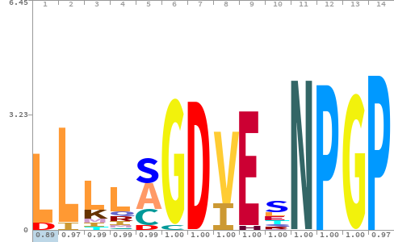
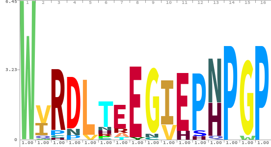

# 2a-peptide-search

## Introduction

The 2A peptide is a short (~15 residue) cis-acting oligopeptide that causes the
ribosome to skip a peptide bond between a Gly-Pro dipeptide. 2A peptides are
thought to interact with specific residues in the ribosome exit channel.
Previous studies described 2A and 2A-like peptides that are broadly distributed
in other RNA viruses, and typically occur between proteins with specific
functions, including viral coat proteins and enzymes involved in viral
replication.

2A peptides have conserved sequence features making them amenable to
construction of profile hidden Markov models, which capture sequence elements in
a statistical model suitable for searching large protien sequence databases. In
particular, the Pro-Gly-Pro residues at its C-terminus are critical for 2A
skipping activity.

## Data availability

Profile HMMs of class 1 and 2 2A peptides are in `curated-models/`.

The `full` and `seed` alignments are the complete and non-redundant
sequence matches to the UniProt, MGnify, and UniParc databases. Profile
HMMs for use with [HMMER](http://hmmer.org/) are build from the seed alignments.

Searches with the class 1 and 2 models will identify e.g. partial matches
between the class 2 model and class 1 sequences and vice-versa, due to
similarities between the models.

## Results

We performed a systematic search for 2A peptides using the [hmmer
software](http://hmmer.org/). Starting from a small set of previously described
2A peptides in picornaviruses, we iteratively built and searched three protein
databases (UniProt, UniParc, and MGnify), identifying thousands of 2A peptides.

### Class 1 2A peptides

Visual inspection of multiple sequence alignments revealed a novel 2A
peptide with features resembling the original 2A peptide. The original,
class 1 sequences contain some key features:

- a stretch of leucine residues at the N-terminus
- a central region with a conserved GDVE motif
- C-terminal NPGP redidues, with skipping occuring between the Gly-Pro residues.

<figure>
  
  <figcaption>Logo of 2A peptide Class 1 sequences</figcaption>
</figure>

### Class 2 2A peptides

Class 2 2A peptides are similar to class 1 with some key distinctions.

- An absolutely conserved tryptophan residue at the N-terminus.
- No runs of leucine codons, but specific conserved residues in the
  central region similar to class 1 (e.g., GDVE in class 1, EEGIE in class
  2)
- Examples with PNPGP and PHPGP residues at the C-terminus.

<figure>
  
  <figcaption>Logo of 2A peptide Class 2 sequences</figcaption>
</figure>

### Todo

- [ ] Examine distribution of proteins on N- and C-terminal sides of 2A
  peptides
- [ ] Examine codon usage across 2A peptides. This is only straightforward
  (possible?) with Uniprot entries.

## Methods

### Protein databases

- [Uniprot](https://www.uniprot.org/help/about) - highly curated reference proteins, pan-organism
- [Uniparc](https://www.uniprot.org/help/uniparc) - non-redundant, uncurated, pan-organism
- [MGnify](https://www.ebi.ac.uk/metagenomics/about) sequences from enrivonmental samples

### Multiple sequence alignments

We created multiple sequence alignments using `hmmalign` and visualized them
with [Jalview](https://www.jalview.org/). Neighbor-joing trees were calulcated
for sequences in the MSA and the MSA was tree-sorted to identify sequence
similarities. Seed alignments were also calculated by eliminating redundant
sequences from the aligment. Sequence logos in `img/` were created with
[Skylign](https://bmcbioinformatics.biomedcentral.com/articles/10.1186/1471-2105-15-7).

## References

- https://en.wikipedia.org/wiki/2A_self-cleaving_peptides

- Wang Y, Wang F, Wang R, Zhao P, Xia Q. 2A self-cleaving peptide-based
multi-gene expression system in the silkworm Bombyx mori. Sci Rep. 2015
Nov 5;5:16273. doi: 10.1038/srep16273. PMID: 26537835; PMCID: PMC4633692.

- Liu Z, Chen O, Wall JBJ, Zheng M, Zhou Y, Wang L, Vaseghi HR, Qian L, Liu
J. Systematic comparison of 2A peptides for cloning multi-genes in a
polycistronic vector. Sci Rep. 2017 May 19;7(1):2193. doi:
10.1038/s41598-017-02460-2. PMID: 28526819; PMCID: PMC5438344.

- Sharma P, Yan F, Doronina VA, Escuin-Ordinas H, Ryan MD, Brown JD. 2A
peptides provide distinct solutions to driving stop-carry on translational
recoding. Nucleic Acids Res. 2012 Apr;40(7):3143-51. doi:
10.1093/nar/gkr1176. Epub 2011 Dec 2. PMID: 22140113; PMCID: PMC3326317.

- Luke GA, de Felipe P, Lukashev A, Kallioinen SE, Bruno EA, Ryan MD.
Occurrence, function and evolutionary origins of '2A-like' sequences in
virus genomes. J Gen Virol. 2008 Apr;89(Pt 4):1036-1042. doi:
10.1099/vir.0.83428-0. PMID: 18343847; PMCID: PMC2885027.

- de Lima JGS, Lanza DCF. 2A and 2A-like Sequences: Distribution in
Different Virus Species and Applications in Biotechnology. Viruses. 2021
Oct 26;13(11):2160. doi: 10.3390/v13112160. PMID: 34834965; PMCID:
PMC8623073.

- Nibert, Max L. “'2A-like' and 'shifty heptamer' motifs in penaeid
shrimp infectious myonecrosis virus, a monosegmented double-stranded RNA
virus.” The Journal of general virology vol. 88,Pt 4 (2007):
1315-1318. doi:10.1099/vir.0.82681-0
