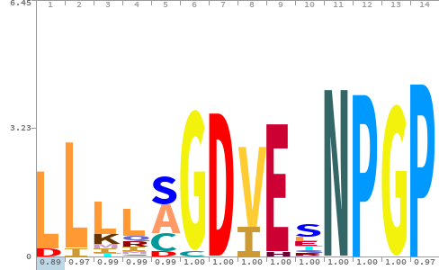
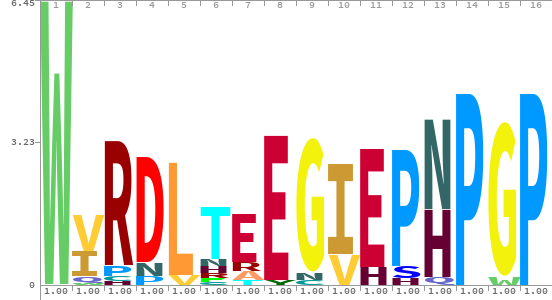

# 2A Peptide Search Pipeline

Automated discovery and characterization of 2A peptides and prokaryotic ribosomal stalling peptides using profile hidden Markov models (HMMs).

## Overview

This repository contains a Snakemake pipeline for identifying:
- **Eukaryotic 2A peptides**: Viral peptides causing ribosomal skipping
- **Prokaryotic stalling peptides**: Bacterial/archaeal peptides causing ribosomal stalling (SecM, TnaC, etc.)

The 2A peptide is a short (~15 residue) cis-acting oligopeptide that causes the ribosome to skip a peptide bond between Gly-Pro dipeptides. 2A peptides interact with specific residues in the ribosome exit channel and are broadly distributed in RNA viruses, typically occurring between proteins with specific functions (viral coat proteins, replication enzymes).

2A peptides have conserved sequence features making them amenable to profile HMM construction, which captures sequence elements in a statistical model suitable for searching large protein databases.

## Quick Start

### Setup

```bash
# Install pixi (if not already installed)
curl -fsSL https://pixi.sh/install.sh | bash

# Install dependencies
pixi install

# Run pipeline (local)
pixi run snakemake --cores 12

# Run on SLURM cluster
sbatch submit-slurm.sh
```

### Project Structure

```
.
├── workflow/
│   ├── Snakefile                 # Main pipeline
│   ├── config.yaml               # Configuration
│   ├── rules/                    # Modular rules
│   │   ├── download.smk         # Database downloads
│   │   ├── search.smk           # HMM searches
│   │   ├── refine.smk           # Model refinement
│   │   ├── prokaryotic.smk      # Prokaryotic discovery
│   │   └── report.smk           # Report generation
│   ├── scripts/                  # Analysis scripts
│   └── envs/                     # Conda environments
├── resources/
│   ├── seed-alignments/          # Curated 2A seed alignments
│   └── stalling-peptides/        # Known prokaryotic stalling peptides
├── cluster/slurm/                # SLURM cluster config
├── results/                      # Pipeline outputs
└── legacy/                       # Historical results

```

See `workflow/README.md` for detailed pipeline documentation. 

## Results

We performed a systematic search for 2A peptides using the [hmmer
software](http://hmmer.org/). Starting from a small set of previously described
2A peptides in picornaviruses, we iteratively built and searched three protein
databases (UniProt, UniParc, and MGnify), identifying thousands of 2A peptides.

### Class 1 2A peptides

Visual inspection of multiple sequence alignments revealed a novel 2A
peptide with features resembling the original 2A peptide. The original,
class 1 sequences contain some key features:

- a stretch of leucine residues at the N-terminus
- a central region with a conserved GDVE motif
- C-terminal NPGP redidues, with skipping occuring between the Gly-Pro residues.

<figure>
  
  <figcaption>Logo of 2A peptide Class 1 sequences</figcaption>
</figure>

### Class 2 2A peptides

Class 2 2A peptides are similar to class 1 with some key distinctions.

- An invariant tryptophan residue at the N-terminus.
- No runs of leucine codons, but specific conserved residues in the
  central region similar to class 1 (e.g., GDVE in class 1, EEGIE in class
  2)
- Examples with PNPGP and PHPGP residues at the C-terminus.

<figure>
  
  <figcaption>Logo of 2A peptide Class 2 sequences</figcaption>
</figure>

## Pipeline Workflows

### Eukaryotic 2A Peptide Discovery

**Iterative refinement approach:**
1. Build seed HMMs from curated alignments (`resources/seed-alignments/`)
2. Search protein databases with seed models
3. Filter hits by E-value threshold
4. Build refined HMMs from high-confidence hits
5. Iterate 2-3 times until convergence
6. Manual curation checkpoint for final models

**Databases searched:**
- [UniProt](https://www.uniprot.org/help/about) - Curated reference proteins (~500k sequences)
- [Reference Proteomes](https://www.uniprot.org/help/reference_proteome) - Subset used for Pfam models
- [UniParc](https://www.uniprot.org/help/uniparc) - Non-redundant archive (millions of sequences)
- [MGnify](https://www.ebi.ac.uk/metagenomics/about) - Environmental/metagenomic sequences (25 split files, ~270GB)
- [IMG/VR](https://genome.jgi.doe.gov/portal/IMG_VR/IMG_VR.home.html) - Viral genomes (requires manual download)

### Prokaryotic Stalling Peptide Discovery

**Three complementary strategies:**

1. **Seed-based discovery** (NEW)
   - Start with 47 known stalling peptides from PMID 38565864
   - Build comprehensive HMM from all peptides (broad search)
   - Build motif-specific HMMs (RAGP, QAPP, etc.) for targeted search

2. **Domain-guided discovery**
   - Extract all GP-containing sequences
   - Annotate protein domains
   - Focus on inter-domain GP motifs (hypothesis: stalling occurs at domain boundaries)

3. **Unbiased discovery**
   - Extract all GP motifs regardless of position
   - Validates other approaches

See `workflow/PROKARYOTIC-DISCOVERY.md` for details.

## Methods

### HMM Construction

Profile HMMs are built using [HMMER](http://hmmer.org/) from curated multiple sequence alignments:
- Alignments created with `hmmalign` or MUSCLE
- Visualized with [Jalview](https://www.jalview.org/)
- Sequence logos created with [Skylign](https://bmcbioinformatics.biomedcentral.com/articles/10.1186/1471-2105-15-7)

### Database Handling

**MGnify**: Downloaded as 25 split files in parallel, optionally merged for searching
**IMG/VR**: Requires web login - download manually and set `local_path` in config

## Configuration

Edit `workflow/config.yaml` to customize:

```yaml
# Select databases to search
databases_to_search:
  - uniprot
  - reference_proteomes
  # - uniparc      # Large, takes time
  # - mgnify       # Very large (~270GB)
  # - imgvr        # Requires manual download

# Set IMG/VR local path (after manual download)
databases:
  imgvr:
    local_path: "/path/to/IMGVR_all_proteins.faa.gz"

# Adjust thresholds
thresholds:
  evalue: 1e-5
  identity: 0.95
```

## Running the Pipeline

**Common commands:**
```bash
# Full pipeline
pixi run snakemake --cores 12

# Test with UniProt only
pixi run snakemake test --cores 12

# Download databases
pixi run snakemake download_all --cores 4

# Prokaryotic discovery
pixi run snakemake --cores 12 -s workflow/rules/prokaryotic.smk

# On SLURM cluster
sbatch submit-slurm.sh
```

**See also:**
- `workflow/README.md` - Detailed pipeline documentation
- `workflow/PROKARYOTIC-DISCOVERY.md` - Prokaryotic discovery guide
- `cluster/slurm/README.md` - SLURM cluster setup

## Output Structure

```
results/
├── models/                      # HMM models
│   ├── seed/                   # Initial models
│   ├── iter1_refined/          # First refinement
│   └── iter2_refined/          # Second refinement
├── searches/                    # Search results by database
├── alignments/                  # Filtered alignments
└── prokaryotic/                 # Prokaryotic discovery
    ├── seed_searches/          # Seed-based searches
    ├── gp_motifs/              # GP motif extraction
    └── models/                 # Prokaryotic HMMs
```

## Data Availability

**Historical results** (pre-Snakemake): `legacy/` directory contains previous searches and curated models.

**Current pipeline outputs**: Generated in `results/` by running the Snakemake pipeline.

## References

- https://en.wikipedia.org/wiki/2A_self-cleaving_peptides

- Wang Y, Wang F, Wang R, Zhao P, Xia Q. 2A self-cleaving peptide-based
multi-gene expression system in the silkworm Bombyx mori. Sci Rep. 2015
Nov 5;5:16273. doi: 10.1038/srep16273. PMID: 26537835; PMCID: PMC4633692.

- Liu Z, Chen O, Wall JBJ, Zheng M, Zhou Y, Wang L, Vaseghi HR, Qian L, Liu
J. Systematic comparison of 2A peptides for cloning multi-genes in a
polycistronic vector. Sci Rep. 2017 May 19;7(1):2193. doi:
10.1038/s41598-017-02460-2. PMID: 28526819; PMCID: PMC5438344.

- Sharma P, Yan F, Doronina VA, Escuin-Ordinas H, Ryan MD, Brown JD. 2A
peptides provide distinct solutions to driving stop-carry on translational
recoding. Nucleic Acids Res. 2012 Apr;40(7):3143-51. doi:
10.1093/nar/gkr1176. Epub 2011 Dec 2. PMID: 22140113; PMCID: PMC3326317.

- Luke GA, de Felipe P, Lukashev A, Kallioinen SE, Bruno EA, Ryan MD.
Occurrence, function and evolutionary origins of '2A-like' sequences in
virus genomes. J Gen Virol. 2008 Apr;89(Pt 4):1036-1042. doi:
10.1099/vir.0.83428-0. PMID: 18343847; PMCID: PMC2885027.

- de Lima JGS, Lanza DCF. 2A and 2A-like Sequences: Distribution in
Different Virus Species and Applications in Biotechnology. Viruses. 2021
Oct 26;13(11):2160. doi: 10.3390/v13112160. PMID: 34834965; PMCID:
PMC8623073.

- Nibert, Max L. "'2A-like' and 'shifty heptamer' motifs in penaeid
shrimp infectious myonecrosis virus, a monosegmented double-stranded RNA
virus." The Journal of general virology vol. 88,Pt 4 (2007):
1315-1318. doi:10.1099/vir.0.82681-0

### Prokaryotic Stalling Peptides

- Ito K, Chiba S. Arrest peptides: cis-acting modulators of translation.
Annu Rev Biochem. 2013;82:171-202. doi: 10.1146/annurev-biochem-080211-105026.
PMID: 23746254.

- Weaver J, Mohammad F, Buskirk AR, Storz G. Identifying Small Proteins by
Ribosome Profiling with Stalled Initiation Complexes. mBio. 2019;10(2):e02819-18.
doi: 10.1128/mBio.02819-18. PMID: 30837344; PMCID: PMC6401487.

- Discovered stalling peptides dataset from Weaver et al. (2024). PMID: 38565864.
