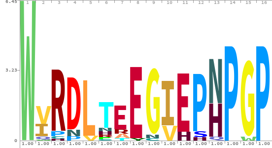

Downloaded protein sequences from IMGVR v4 (version IMG_VR_2022-12-19_7.1)

https://genome.jgi.doe.gov/portal/pages/dynamicOrganismDownload.jsf?organism=IMG_VR

## DD clade

The class 2 hits seems to have some insertions at key points in the middle (two Asp residues).

1. used Jalview to select out relevant sequences with DD insertions (in `DD-clade`).

2. Build logo and examine

The DD sequences do have one extra Asp residue in the middle of the 2A sequence. Compare:

<figure>
  
  <figcaption>Logo of class 2-DD 2A peptide sequences</figcaption>
</figure>

 

<figure>
  
  <figcaption>Logo of 2A peptide Class 2 sequences</figcaption>
</figure>

